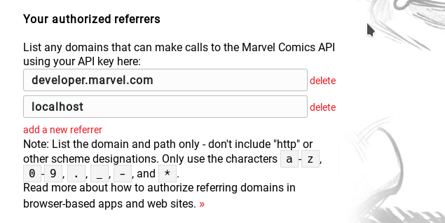

# Desafio técnico Kinghost
Desafio técnico proposto para avaliação de candidatura a emprego

### Pré-requisitos:
1. Registrar uma conta em [https://www.marvel.com/signin](https://www.marvel.com/signin) para obter uma chave de API
2. Registrar a página web que irá realizar as requisições (referrer) em [https://developer.marvel.com/account#](https://developer.marvel.com/account#), como na imagen seguinte:

### Configuração:
Antes de proceder à instalação, edite o arquivo **marvel_developer.conf** e adicione a sua chave pública (apikey) e altere, caso deseje, a sua lista de heróis favoritos.

### Instalação:
Esta aplicação utiliza linguagem Perl que está presente na quase totalidade das distribuições GNU/Linux, mas adicionalmente pode ser necessário instalar alguns módulos. Em distribuições baseadas no Debian, com apt, execute no shell (remover o sudo, caso já esteja logado como usuário **root**):

`$ sudo apt-get install libutf8-all-perl libjson-perl libfile-basedir-perl`

### Versão em container:
Proceda com os seguintes comandos:

    $ git clone https://github.com/codevenger/desafio_tecnico
    $ cd desafio_tecnico
    $ docker build -t docker-apache-perl .
    $ docker run -v /var/www/html:/var/www/html -v $(pwd)/desafio_tecnico/src:/usr/local/sbin --name my_heros -p 80:80 -d docker-apache-perl /bin/bash -c "/usr/sbin/apache2ctl -D FOREGROUND"
    $ docker exec my_heros /bin/bash -c "/usr/local/sbin/make_page.pl" -it
    
    
Por fim, abra com seu navegador preferido o endereço [http://localhost/](http://localhost)

É possível gerar novamente uma página atualizada, utilizando o seguinte comando:
`$ docker exec my_heros /bin/bash -c "/usr/local/sbin/make_page.pl" -it`

